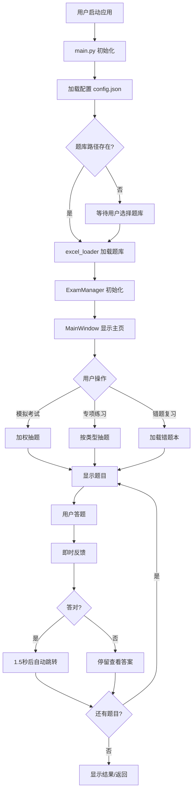

# PC应用技术文档 - 总览

## 文档说明

本文档详细记录了pc-app（技能士考试刷题系统）的完整技术实现，便于将来适配到其他平台（如Web、iOS、Android等）。

## 文档结构

1. **技术文档-01-总览.md** - 本文件，项目概览和架构介绍
2. **技术文档-02-主入口.md** - main.py 详解
3. **技术文档-03-题库加载.md** - excel_loader.py 详解
4. **技术文档-04-考试核心.md** - exam_core.py 详解
5. **技术文档-05-UI界面.md** - ui_build.py 详解
6. **技术文档-06-数据格式.md** - 配置和数据文件格式说明
7. **技术文档-07-跨平台适配.md** - 跨平台开发注意事项

## 项目概览

### 应用信息
- **名称**: 技能士考试刷题系统
- **版本**: v2.3
- **开发框架**: PyQt6 (Python桌面GUI)
- **主要功能**: 模拟考试、专项练习、错题本管理

### 核心特性
1. ✅ Excel题库加载（支持多Sheet选择）
2. ✅ 加权分级考试（根据等级混合题目难度）
3. ✅ 题目来源筛选
4. ✅ 实时答题反馈
5. ✅ 自动跳题（答对后1.5秒自动跳转）
6. ✅ 专项练习（按题型和等级）
7. ✅ 错题本记录和复习
8. ✅ 练习进度保存
9. ✅ TTS语音读题（Windows SAPI）

## 技术架构

### 项目目录结构
```
pc-app/
├── main.py                          # 应用入口
├── main_code/                       # 核心代码目录
│   ├── excel_loader.py              # 题库加载模块
│   ├── exam_core.py                 # 考试逻辑模块
│   └── ui_build.py                  # UI界面模块
├── exam_bank/                       # 题库文件夹
│   └── *.xlsx                       # Excel题库文件
├── config.json                      # 配置文件（记录上次题库路径）
├── error_questions.json             # 错题记录
├── practice_progress.json           # 练习进度
├── dist/                            # 打包后的可执行文件
└── README.md                        # 使用说明
```

### 模块划分

#### 1. main.py - 应用入口
- 程序启动和初始化
- TTS工作进程管理
- 全局字体设置

#### 2. excel_loader.py - 题库加载
- Excel文件解析
- 题目数据结构化
- 题目筛选和随机抽取

#### 3. exam_core.py - 考试核心逻辑
- 考试配置管理
- 加权题目分配
- 答案提交和判分
- 错题本管理

#### 4. ui_build.py - 用户界面
- 主窗口和页面布局
- 题目显示和交互
- 答题反馈展示
- 计时器和导航

## 数据流图



## 关键技术点

### 1. 题库数据格式
- **文件格式**: Excel (.xlsx)
- **表头位置**: 第4行（索引3）
- **必需列**: 考题类型、题目、答案
- **可选列**: 选项A-E、一级至六级、来源

### 2. 题型支持
- **单选题**: 一个正确答案，点击选项自动判分
- **多选题**: 多个正确答案，需手动提交判分
- **判断题**: √/× 二选一，点击自动判分
- **简答题**: 文本答案，手动查看参考答案

### 3. 加权考试规则
```python
LEVEL_WEIGHTS = {
    '一级': {'一级': 0.8, '二级': 0.2},
    '二级': {'一级': 0.1, '二级': 0.7, '三级': 0.2},
    '三级': {'二级': 0.1, '三级': 0.7, '四级': 0.2},
    '四级': {'三级': 0.1, '四级': 0.7, '五级': 0.2},
    '五级': {'四级': 0.1, '五级': 0.7, '六级': 0.2},
    '六级': {'五级': 0.1, '六级': 0.9}
}
```

### 4. 评分标准
- 单选题: 1分/题
- 多选题: 2分/题
- 判断题: 1分/题
- 简答题: 10分/题
- 及格线: 80分

## 技术栈总结

### Python依赖
```
PyQt6          # GUI框架
pandas         # Excel数据处理
openpyxl       # Excel文件读写
pywin32        # Windows TTS API（仅Windows）
```

### 平台特定功能
- **TTS语音**: 使用Windows SAPI，需适配其他平台
- **进程管理**: subprocess 创建TTS工作进程
- **文件选择**: QFileDialog

## 下一步阅读

请按顺序阅读以下详细文档：
1. [技术文档-02-主入口.md](./技术文档-02-主入口.md) - 程序启动流程
2. [技术文档-03-题库加载.md](./技术文档-03-题库加载.md) - 题库数据处理
3. [技术文档-04-考试核心.md](./技术文档-04-考试核心.md) - 业务逻辑实现
4. [技术文档-05-UI界面.md](./技术文档-05-UI界面.md) - 界面交互设计
5. [技术文档-06-数据格式.md](./技术文档-06-数据格式.md) - 数据文件规范
6. [技术文档-07-跨平台适配.md](./技术文档-07-跨平台适配.md) - 移植指南
