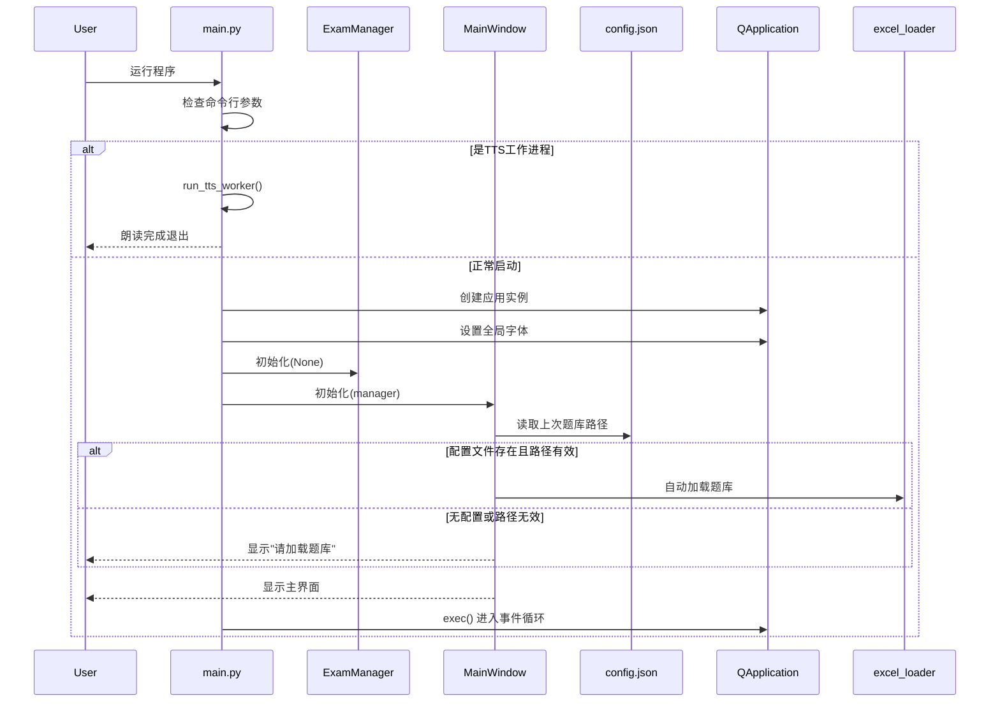

# PC应用技术文档 - 主入口模块

## 文件信息
- **文件名**: `main.py`
- **行数**: 91行
- **职责**: 应用程序入口、TTS工作进程、全局初始化

## 完整代码结构

### 1. 导入依赖 (第1-10行)
```python
import sys
import os
from PyQt6.QtWidgets import QApplication, QMessageBox

# 添加项目根目录到Python路径
sys.path.append(os.path.dirname(os.path.abspath(__file__)))

from main_code.excel_loader import QuestionBank
from main_code.exam_core import ExamManager
from main_code.ui_build import MainWindow
```

**关键点**:
- 使用PyQt6作为GUI框架
- 动态添加项目路径,确保模块可导入
- 导入三个核心模块: 题库、考试逻辑、UI界面

**跨平台注意**:
- `sys.path.append` 在所有平台通用
- 路径分隔符使用 `os.path` 处理,避免硬编码

---

### 2. TTS工作进程函数 (第12-59行)

```python
def run_tts_worker():
    """
    TTS（文本转语音）工作进程
    通过子进程方式调用,避免阻塞主界面
    """
    import traceback
    try:
        import win32com.client  # Windows特定TTS库
        import pythoncom        # COM组件初始化
    except ImportError:
        return  # 非Windows平台直接返回

    # 从标准输入读取要朗读的文本
    try:
        input_bytes = sys.stdin.buffer.read()
        text = input_bytes.decode('utf-8')
    except Exception:
        return

    if not text or not text.strip():
        return

    try:
        # 初始化COM组件（Windows必需）
        pythoncom.CoInitialize()
        
        # 创建SAPI语音对象
        speaker = win32com.client.Dispatch("SAPI.SpVoice")
        
        # 选择语音（优先选择Huihui中文女声）
        try:
            voices = speaker.GetVoices()
            for i in range(voices.Count):
                voice = voices.Item(i)
                desc = voice.GetDescription()
                if 'Huihui' in desc or 'Chinese' in desc:
                    speaker.Voice = voice
                    break
        except:
            pass  # 使用默认语音
            
        # 设置语速（-10到10,0为正常）
        try:
            speaker.Rate = 0
        except:
            pass
            
        # 同步朗读（阻塞直到完成）
        speaker.Speak(text, 0)
        
    except Exception:
        pass  # 静默失败,不影响主程序
    finally:
        pythoncom.CoUninitialize()  # 清理COM资源
```

**关键点**:
1. **独立进程设计**: 通过 `subprocess.Popen` 调用,避免阻塞UI
2. **编码处理**: 使用UTF-8确保中文正确传递
3. **语音选择**: 优先使用"Huihui"中文女声
4. **资源管理**: `CoInitialize` 和 `CoUninitialize` 配对使用

**跨平台适配要点**:
- ⚠️ **Windows专属**: `win32com` 和 SAPI 仅在Windows可用
- 替代方案:
  - **macOS**: 使用 `pyttsx3` 或 `say` 命令
  - **Android**: 使用 Android TTS API
  - **Web**: 使用 Web Speech API
  - **iOS**: 使用 AVSpeechSynthesizer

**适配代码示例**:
```python
# 跨平台TTS抽象
def speak_text(text):
    if sys.platform == 'win32':
        # Windows SAPI
        run_tts_worker()
    elif sys.platform == 'darwin':
        # macOS
        os.system(f'say "{text}"')
    elif sys.platform == 'linux':
        # Linux (需安装 espeak)
        os.system(f'espeak "{text}"')
```

---

### 3. 主函数 (第61-90行)

```python
def main():
    # 检查是否为TTS工作进程
    if len(sys.argv) > 1 and sys.argv[1] == '--tts-worker':
        run_tts_worker()
        return

    # 创建Qt应用实例
    app = QApplication(sys.argv)
    
    # 设置全局字体
    font = app.font()
    font.setFamily("Microsoft YaHei")  # 微软雅黑
    font.setPointSize(10)
    app.setFont(font)

    try:
        # 初始化考试管理器（无题库）
        manager = ExamManager(None)
        
        # 初始化主窗口
        window = MainWindow(manager)
        window.show()
        
        # 进入事件循环
        sys.exit(app.exec())
        
    except Exception as e:
        # 启动失败时显示错误
        QMessageBox.critical(None, "严重错误", f"程序启动失败:\n{str(e)}")
        print(f"Critical Error: {e}")

if __name__ == "__main__":
    main()
```

**执行流程**:
```
1. 检查命令行参数
   ├── 如果是 --tts-worker → 执行TTS工作进程
   └── 否则 → 继续主程序

2. 创建Qt应用
   └── 设置全局字体（微软雅黑10pt）

3. 初始化业务逻辑
   └── ExamManager(None)  # 题库稍后加载

4. 初始化UI
   └── MainWindow(manager)

5. 显示窗口并进入事件循环
   └── app.exec()  # 阻塞等待用户操作
```

**关键点**:
1. **延迟加载题库**: 初始化时不加载,由用户选择或从config加载
2. **全局字体**: 确保中文显示美观
3. **异常捕获**: 启动失败时显示友好错误提示

**跨平台注意**:
- **字体选择**: "Microsoft YaHei" 仅Windows可用
  - macOS: "PingFang SC" 或 "Heiti SC"
  - Linux: "Noto Sans CJK SC" 或 "WenQuanYi Micro Hei"
- **PyQt6**: 跨平台兼容,但需在各平台分别安装

---

## 程序启动完整流程



---

## 跨平台适配清单

### ✅ 完全兼容
- [x] Python基础语法
- [x] 模块导入机制
- [x] 异常处理逻辑

### ⚠️ 需要适配
- [ ] **TTS功能**: Windows SAPI → 各平台原生API
- [ ] **全局字体**: Microsoft YaHei → 各平台中文字体
- [ ] **子进程管理**: Windows creation_flags → 各平台参数

### 🔄 替代方案
| 功能 | Windows实现 | 替代方案 |
|------|------------|---------|
| TTS | `win32com.client.Dispatch("SAPI.SpVoice")` | pyttsx3(跨平台库) |
| 中文字体 | Microsoft YaHei | 系统检测+回退机制 |
| GUI框架 | PyQt6 | Kivy/Flutter(更跨平台) |

---

## 代码优化建议

### 1. 字体自动检测
```python
def get_system_font():
    if sys.platform == 'win32':
        return "Microsoft YaHei"
    elif sys.platform == 'darwin':
        return "PingFang SC"
    else:
        return "Noto Sans CJK SC"

font.setFamily(get_system_font())
```

### 2. TTS抽象层
```python
class TTSService:
    @staticmethod
    def speak(text):
        if sys.platform == 'win32':
            # Windows SAPI实现
            pass
        elif sys.platform == 'darwin':
            # macOS实现
            pass
```

### 3. 配置文件路径
```python
# 使用用户目录而非程序目录
from pathlib import Path
CONFIG_DIR = Path.home() / ".exam_system"
CONFIG_DIR.mkdir(exist_ok=True)
CONFIG_FILE = CONFIG_DIR / "config.json"
```

---

## 下一步阅读
[技术文档-03-题库加载.md](./技术文档-03-题库加载.md) - 详解Excel题库解析逻辑
