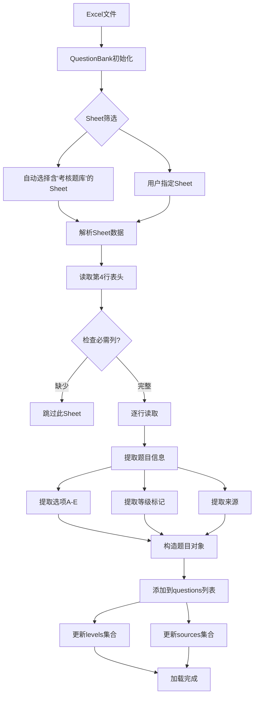

# PC应用技术文档 - 题库加载模块

## 文件信息
- **文件名**: `main_code/excel_loader.py`
- **行数**: 208行
- **职责**: Excel题库解析、题目筛选、随机抽取

## 模块概述

`QuestionBank` 类负责从Excel文件中加载题目数据,提供题目筛选、统计和随机抽取功能。

---

## 核心类: QuestionBank

### 类结构

```python
class QuestionBank:
    def __init__(self, file_path, selected_sheets=None)
    
    # 属性
    self.file_path          # Excel文件路径
    self.selected_sheets    # 选中的Sheet列表
    self.questions          # 所有题目列表
    self.levels             # 所有等级集合 {'一级', '二级', ...}
    self.sources            # 所有来源集合 {'Sheet1', '2024题库', ...}
```

---

## 方法详解

### 1. 初始化方法 (第6-12行)

```python
def __init__(self, file_path, selected_sheets=None):
    """
    参数:
        file_path: Excel文件绝对路径
        selected_sheets: 要加载的Sheet名称列表,None表示自动选择
    """
    self.file_path = file_path
    self.selected_sheets = selected_sheets
    self.questions = []
    self.levels = set()
    self.sources = set()
    self.load_data()  # 立即加载数据
```

**设计要点**:
- 构造时即加载数据,失败会抛出异常
- `levels` 和 `sources` 使用集合自动去重

---

### 2. 获取所有Sheet名称 (第14-22行)

```python
@staticmethod
def get_all_sheet_names(file_path):
    """静态方法,用于在加载前预览Sheet列表"""
    if not os.path.exists(file_path):
        return []
    try:
        xl = pd.ExcelFile(file_path)
        return xl.sheet_names
    except:
        return []
```

**用途**: UI层调用此方法获取Sheet列表,让用户选择要加载的Sheet

**跨平台注意**:
- 依赖 `pandas` 和 `openpyxl`
- 两者均跨平台,但需确保安装

---

### 3. 加载数据 (第24-102行) - 核心方法

#### 3.1 Sheet筛选逻辑 (第24-38行)

```python
def load_data(self):
    if not os.path.exists(self.file_path):
        raise FileNotFoundError(f"题库文件未找到: {self.file_path}")

    xl = pd.ExcelFile(self.file_path)
    
    # Sheet选择策略
    if self.selected_sheets:
        # 用户指定Sheet
        valid_sheets = [s for s in xl.sheet_names if s in self.selected_sheets]
    else:
        # 自动选择: 包含"考核题库"或名为"Sheet1"的Sheet
        valid_sheets = [s for s in xl.sheet_names 
                        if "考核题库" in s or s == "Sheet1"]
        # 排除透视表Sheet
        valid_sheets = [s for s in valid_sheets if "透视" not in s]
```

**筛选规则**:
1. 优先使用用户指定的Sheet
2. 自动模式: 选择包含"考核题库"或名为"Sheet1"的Sheet
3. 排除名称包含"透视"的Sheet（通常是数据透视表）

**跨平台注意**:
- 中文字符串匹配在所有平台一致
- 使用 `in` 运算符而非正则,性能更好

#### 3.2 Excel解析逻辑 (第41-54行)

```python
for sheet_name in valid_sheets:
    # 从第4行开始读取（前3行为标题/说明）
    df = xl.parse(sheet_name, header=3)
    
    # 列名标准化（去除空格）
    df.columns = [str(c).strip() for c in df.columns]
    
    # 检查必需列
    required_cols = ['考题类型', '题目', '答案']
    if not all(col in df.columns for col in required_cols):
        print(f"跳过Sheet {sheet_name}: 缺少必需列")
        continue

    # 过滤空行
    df = df.dropna(subset=['题目', '答案'])
```

**关键设计**:
- **header=3**: Excel第4行为表头（索引从0开始）
- **列名标准化**: 避免因空格导致的匹配失败
- **必需列检查**: 确保数据完整性
- **空行过滤**: 清理无效数据

**Excel表格结构示例**:
```
第1行: 【标题】技能士考试题库
第2行: 【说明】本题库包含...
第3行: 【空行】
第4行: 考题类型 | 题目 | 选项A | ... | 答案 | 一级 | 二级 | ...
第5行: 单选题   | xxx  | xxx   | ... | A    | ✓   |     | ...
```

#### 3.3 题目数据提取 (第56-95行)

```python
for _, row in df.iterrows():
    # 基础信息
    q_type = str(row['考题类型']).strip()      # 题型
    question = str(row['题目']).strip()       # 题干
    answer = str(row['答案']).strip()         # 答案
    
    # 提取选项 (A-E)
    options = {}
    for opt in ['A', 'B', 'C', 'D', 'E']:
        col_name = f'选项{opt}'
        if col_name in df.columns and pd.notna(row[col_name]):
            options[opt] = str(row[col_name]).strip()
    
    # 提取等级标记
    q_levels = []
    level_cols = ['一级', '二级', '三级', '四级', '五级', '六级']
    for lvl in level_cols:
        if lvl in df.columns and pd.notna(row[lvl]):
            # 只要该列有值（不为空）就认为属于该等级
            q_levels.append(lvl)
            self.levels.add(lvl)

    # 提取来源
    source = sheet_name  # 默认使用Sheet名称
    if '来源' in df.columns:
        val = row['来源']
        if pd.notna(val):
            source = str(val).strip()
    self.sources.add(source)

    # 构造题目数据结构
    q_data = {
        'type': q_type,
        'question': question,
        'options': options,
        'answer': answer,
        'levels': q_levels,        # 列表,题目可能属于多个等级
        'source_sheet': source
    }
    self.questions.append(q_data)
```

**数据结构设计**:
```python
{
    'type': '单选题',  # 题型: 单选题/多选题/判断题/简答题
    'question': '什么是Python?',  # 题干
    'options': {  # 选项字典
        'A': '编程语言',
        'B': '动物',
        'C': '水果'
    },
    'answer': 'A',  # 正确答案
    'levels': ['一级', '二级'],  # 适用等级（可多个）
    'source_sheet': '2024题库'  # 来源标识
}
```

**关键点**:
1. **多等级支持**: 一道题可以属于多个等级
2. **选项动态读取**: 只读取存在的选项（A-E）
3. **来源灵活性**: 优先使用"来源"列,否则用Sheet名

**跨平台注意**:
- `pd.notna()` 比 `pd.isnull()` 更清晰
- 字符串类型转换确保数据一致性

---

### 4. 获取题目 (第104-140行) - 核心抽题逻辑

```python
def get_questions(self, levels, q_types_counts, selected_sources=None):
    """
    按条件随机抽取题目
    
    参数:
        levels: 等级列表 ['一级', '二级']
        q_types_counts: 题型数量 {'单选题': 40, '多选题': 10}
        selected_sources: 来源筛选 ['Sheet1', 'Sheet2'] 或 None(全选)
    
    返回:
        {'单选题': [q1, q2, ...], '多选题': [...]}
    """
    selected_questions = {}
    
    # 确保levels是列表
    if isinstance(levels, str):
        levels = [levels]
        
    # 第一步: 按等级筛选
    # 题目的levels与选中的levels有交集即符合
    level_questions = [
        q for q in self.questions 
        if any(lvl in q['levels'] for lvl in levels)
    ]
    
    # 第二步: 按来源筛选
    if selected_sources:
        level_questions = [
            q for q in level_questions 
            if q.get('source_sheet') in selected_sources
        ]
    
    # 第三步: 按题型抽取
    for q_type, count in q_types_counts.items():
        type_qs = [q for q in level_questions if q['type'] == q_type]
        
        if len(type_qs) < count:
            # 题目不足,返回所有可用题目
            print(f"警告: {levels} - {q_type} 题目不足. "
                  f"需要: {count}, 可用: {len(type_qs)}")
            selected_questions[q_type] = type_qs
            random.shuffle(selected_questions[q_type])
        else:
            # 随机抽取指定数量
            selected_questions[q_type] = random.sample(type_qs, count)
            
    return selected_questions
```

**筛选流程**:
```
全部题目 (self.questions)
    ↓ 等级筛选
符合等级的题目 (level_questions)
    ↓ 来源筛选 (可选)
符合来源的题目
    ↓ 题型分组
{'单选题': [...], '多选题': [...]}
    ↓ 随机抽取
最终题目集合
```

**关键设计**:
1. **等级匹配**: 使用 `any()` 判断交集,支持多等级题目
2. **数量不足处理**: 返回所有可用题目+警告,不中断流程
3. **随机性**: `random.sample()` 确保每次抽题不同

**跨平台注意**:
- `random.sample()` 在所有平台一致
- 注意随机种子,如需可复现结果可设置 `random.seed()`

---

### 5. 检查题目充足性 (第142-162行)

```python
def check_sufficiency(self, level, requirements):
    """
    检查指定等级的题目是否足够
    
    参数:
        level: 等级 (支持字符串或列表)
        requirements: 需求 {'单选题': 40, '多选题': 10}
    
    返回:
        {
            '单选题': (可用数, 需求数, 是否足够),
            '多选题': (120, 10, True)
        }
    """
    if isinstance(level, str):
        level = [level]
        
    level_questions = [
        q for q in self.questions 
        if any(lvl in q['levels'] for lvl in level)
    ]
    status = {}
    
    for q_type, count in requirements.items():
        type_qs = [q for q in level_questions if q['type'] == q_type]
        status[q_type] = (len(type_qs), count, len(type_qs) >= count)
        
    return status
```

**用途**: UI层在开始考试前检查题库是否充足,提前提示用户

**返回示例**:
```python
{
    '单选题': (120, 40, True),   # 有120道,需要40道,充足
    '多选题': (8, 10, False),    # 有8道,需要10道,不足
    '判断题': (50, 10, True),
    '简答题': (5, 3, True)
}
```

---

### 6. 统计题目数量 (第164-180行)

```python
def get_counts_by_type(self, level):
    """
    统计指定等级各题型的题目数量
    
    返回:
        {'单选题': 120, '多选题': 45, '判断题': 60, '简答题': 15}
    """
    if isinstance(level, str):
        level = [level]

    level_questions = [
        q for q in self.questions 
        if any(lvl in q['levels'] for lvl in level)
    ]
    counts = {}
    for q in level_questions:
        q_type = q['type']
        counts[q_type] = counts.get(q_type, 0) + 1
    return counts
```

**用途**: UI显示题库统计信息,让用户了解可练习的题型

---

### 7. 获取所有题目 (第182-192行)

```python
def get_all_questions(self, level, q_type):
    """
    获取指定等级和题型的所有题目（不限数量）
    用于专项练习模式
    """
    if isinstance(level, str):
        level = [level]
        
    return [
        q for q in self.questions 
        if any(lvl in q['levels'] for lvl in level) and q['type'] == q_type
    ]
```

**用途**: 专项练习模式需要加载某题型的全部题目

---

## 完整数据流程图



---

## Excel题库格式规范

### 必需列
| 列名 | 类型 | 说明 | 示例 |
|------|------|------|------|
| 考题类型 | 文本 | 题型 | 单选题/多选题/判断题/简答题 |
| 题目 | 文本 | 题干 | Python是什么语言? |
| 答案 | 文本 | 正确答案 | A 或 AB 或 √ |

### 可选列
| 列名 | 类型 | 说明 | 示例 |
|------|------|------|------|
| 选项A-E | 文本 | 选择题选项 | 编程语言 |
| 一级~六级 | 任意 | 等级标记 | ✓ 或 1 或任意非空值 |
| 来源 | 文本 | 题目来源 | 2024年题库 |

### 示例表格

| 考题类型 | 题目 | 选项A | 选项B | 选项C | 答案 | 一级 | 二级 | 来源 |
|---------|------|-------|-------|-------|------|------|------|------|
| 单选题 | Python是什么? | 编程语言 | 动物 | 水果 | A | ✓ |  | 基础题库 |
| 多选题 | Python特点? | 简单 | 强大 | 难学 | AB | ✓ | ✓ | 基础题库 |
| 判断题 | Python是脚本语言 | √ | × |  | √ |  | ✓ | 进阶题库 |

---

## 跨平台适配要点

### ✅ 完全兼容
- [x] Pandas数据处理
- [x] 随机数生成
- [x] 文件路径处理

### ⚠️ 注意事项
- 确保安装 `pandas` 和 `openpyxl`
- Excel文件编码: 使用UTF-8避免中文乱码
- 文件路径: 使用 `os.path` 而非硬编码分隔符

### 🔄 替代方案

#### Web平台
```javascript
// 使用 SheetJS (xlsx.js) 解析Excel
const workbook = XLSX.read(data, {type: 'binary'});
const sheet = workbook.Sheets[workbook.SheetNames[0]];
const json = XLSX.utils.sheet_to_json(sheet, {header: 3});
```

#### Android平台
```kotlin
// 使用 Apache POI 解析Excel
val workbook = XSSFWorkbook(FileInputStream(file))
val sheet = workbook.getSheetAt(0)
for (row in sheet) {
    val question = row.getCell(1).stringCellValue
    // ...
}
```

#### iOS平台
```swift
// 使用 ZipArchive + XML解析（xlsx本质是zip）
// 或使用 CoreXLSX 库
import CoreXLSX
let file = XLSXFile(filepath: path)
for worksheet in try file.parseWorksheets() {
    // ...
}
```

---

## 性能优化建议

### 1. 大题库优化
```python
# 当前实现每次遍历全部题目,题库很大时可优化:
# 方法1: 提前建立索引
self.index_by_level = {}  # {'一级': [q1, q2, ...]}
self.index_by_type = {}   # {'单选题': [q1, q2, ...]}

# 方法2: 使用numpy加速
import numpy as np
self.questions_array = np.array(self.questions)
```

### 2. 缓存机制
```python
from functools import lru_cache

@lru_cache(maxsize=128)
def get_counts_by_type(self, level):
    # 结果会被缓存,重复调用直接返回
    ...
```

---

## 下一步阅读
[技术文档-04-考试核心.md](./技术文档-04-考试核心.md) - 详解考试逻辑和评分机制
