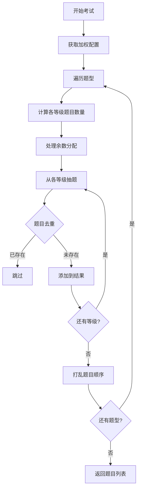
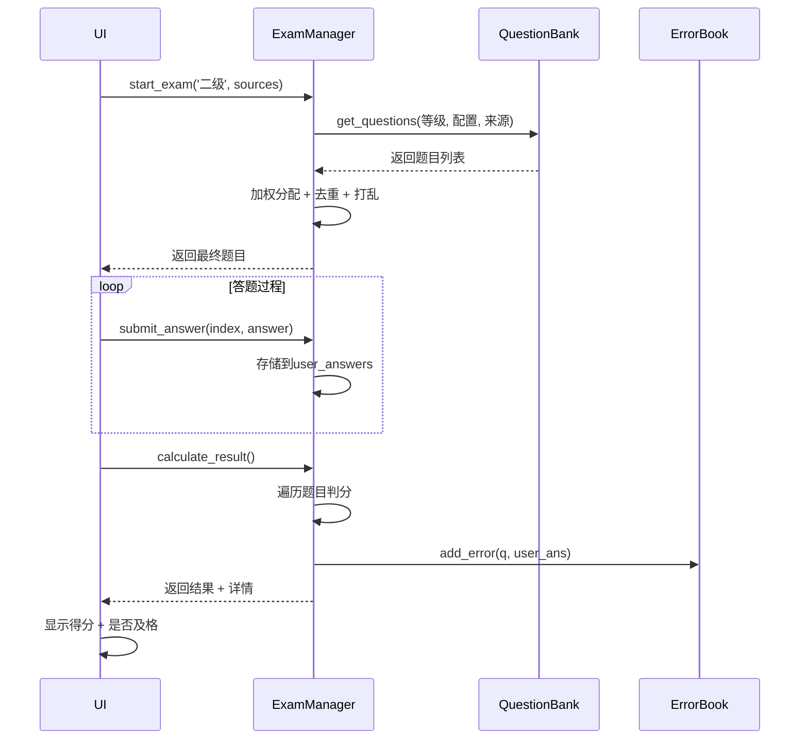

# PC应用技术文档 - 考试核心模块

## 文件信息
- **文件名**: `main_code/exam_core.py`
- **行数**: 261行
- **职责**: 考试配置、加权抽题、评分判题、错题管理

## 模块概述

包含两个核心类:
1. **ErrorBook**: 错题本管理
2. **ExamManager**: 考试流程控制

---

## 类一: ErrorBook (第6-39行)

### 职责
管理用户答错的题目,提供持久化存储和查询功能。

### 完整代码

```python
class ErrorBook:
    def __init__(self, file_path='error_questions.json'):
        self.file_path = file_path
        self.errors = self.load_errors()

    def load_errors(self):
        """从JSON文件加载错题记录"""
        if os.path.exists(self.file_path):
            try:
                with open(self.file_path, 'r', encoding='utf-8') as f:
                    return json.load(f)
            except Exception as e:
                print(f"加载错题本失败: {e}")
                return []
        return []

    def add_error(self, question, user_answer):
        """添加错题"""
        error_entry = {
            'question': question['question'],      # 题干
            'type': question['type'],              # 题型
            'options': question['options'],        # 选项
            'correct_answer': question['answer'],  # 正确答案
            'user_answer': user_answer,            # 用户答案
            'source_sheet': question.get('source_sheet', 'Unknown'),
            'timestamp': datetime.now().strftime("%Y-%m-%d %H:%M:%S")
        }
        self.errors.append(error_entry)
        self.save_errors()

    def save_errors(self):
        """保存错题到JSON文件"""
        try:
            with open(self.file_path, 'w', encoding='utf-8') as f:
                json.dump(self.errors, f, ensure_ascii=False, indent=4)
        except Exception as e:
            print(f"保存错题本失败: {e}")
```

### 数据结构

**错题记录格式**:
```json
{
    "question": "Python是什么语言?",
    "type": "单选题",
    "options": {"A": "编程语言", "B": "动物"},
    "correct_answer": "A",
    "user_answer": "B",
    "source_sheet": "基础题库",
    "timestamp": "2024-11-25 20:00:00"
}
```

### 关键设计
1. **懒加载**: 构造时立即加载,避免重复读取
2. **自动保存**: 每次添加错题立即持久化
3. **UTF-8编码**: 确保中文正确存储
4. **时间戳**: 记录答题时间,便于统计分析

### 跨平台注意
- JSON格式全平台通用
- 使用 `utf-8` 编码避免中文乱码
- 文件路径可配置,建议使用用户目录

---

## 类二: ExamManager (第41-261行)

### 职责
管理考试全流程: 配置→抽题→答题→判分→结果

### 类结构

```python
class ExamManager:
    # 构造函数
    def __init__(self, question_bank)
    
    # 属性
    self.bank = question_bank        # QuestionBank实例
    self.current_questions = []      # 当前考试题目列表
    self.user_answers = {}           # 用户答案 {index: answer}
    self.error_book = ErrorBook()    # 错题本实例
    self.exam_config = {...}         # 考试配置(题型数量)
    self.scores = {...}              # 评分标准(每题分值)
    
    # 静态常量
    LEVEL_WEIGHTS = {...}            # 加权配置
```

---

### 初始化方法 (第42-59行)

```python
def __init__(self, question_bank):
    self.bank = question_bank
    self.current_questions = []
    self.user_answers = {}
    self.error_book = ErrorBook()
    
    # 考试配置: 各题型数量
    self.exam_config = {
        '单选题': 40,
        '多选题': 10,
        '判断题': 10,
        '简答题': 3
    }
    
    # 评分标准: 各题型分值
    self.scores = {
        '单选题': 1,
        '多选题': 2,
        '判断题': 1,
        '简答题': 10
    }
```

**总分计算**:
```
40×1 + 10×2 + 10×1 + 3×10 = 100分
```

---

### 加权配置 (第76-84行)

```python
LEVEL_WEIGHTS = {
    '一级': {'一级': 0.8, '二级': 0.2},
    '二级': {'一级': 0.1, '二级': 0.7, '三级': 0.2},
    '三级': {'二级': 0.1, '三级': 0.7, '四级': 0.2},
    '四级': {'三级': 0.1, '四级': 0.7, '五级': 0.2},
    '五级': {'四级': 0.1, '五级': 0.7, '六级': 0.2},
    '六级': {'五级': 0.1, '六级': 0.9}
}
```

**设计意图**:
- 考一级: 80%一级题 + 20%二级题（略有挑战）
- 考二级: 10%一级题（巩固基础） + 70%二级题（主体） + 20%三级题（拓展）
- 考六级: 10%五级题 + 90%六级题（高难度为主）

**配置示例 - 二级考试题目分配**:
```
单选题 40道:
  一级: 40 × 0.1 = 4道
  二级: 40 × 0.7 = 28道
  三级: 40 × 0.2 = 8道

多选题 10道:
  一级: 10 × 0.1 = 1道
  二级: 10 × 0.7 = 7道
  三级: 10 × 0.2 = 2道
```

---

### 开始考试 (第86-169行) - 核心方法

```python
def start_exam(self, target_level, selected_sources=None):
    """
    开始加权考试
    
    参数:
        target_level: 目标等级 (如 '二级')
        selected_sources: 过滤来源 (可选)
    
    返回:
        题目列表 (打乱顺序的平铺列表)
    """
    if not self.bank:
        return []
        
    self.user_answers = {}  # 清空之前的答案
    
    # 获取加权配置
    level_weights = self.LEVEL_WEIGHTS.get(target_level, {target_level: 1.0})
    
    final_questions = []
    seen_questions = set()  # 用于防重复（通过题干hash）
    
    # 遍历每种题型
    for q_type, total_count in self.exam_config.items():
        type_questions = []
        counts_per_level = {}
        current_total = 0
        
        sorted_levels = sorted(level_weights.keys())
        
        # 计算各等级应抽取的数量（向下取整）
        for lvl in sorted_levels:
            w = level_weights[lvl]
            count = int(total_count * w)
            counts_per_level[lvl] = count
            current_total += count
            
        # 分配余数到目标等级
        remainder = total_count - current_total
        if remainder > 0:
            if target_level in counts_per_level:
                counts_per_level[target_level] += remainder
            else:
                counts_per_level[sorted_levels[0]] += remainder
        
        # 从各等级抽题
        for lvl, count in counts_per_level.items():
            if count <= 0:
                continue
                
            # 获取该等级该题型的所有题目
            temp_config = {q_type: 999}  # 获取全部
            qs_dict = self.bank.get_questions(lvl, temp_config, selected_sources)
            
            if q_type in qs_dict and len(qs_dict[q_type]) > 0:
                available_qs = qs_dict[q_type]
                
                # 过滤已选题目（防重复）
                unique_available = [
                    q for q in available_qs 
                    if q['question'] not in seen_questions
                ]
                
                # 随机抽取
                if len(unique_available) >= count:
                    selected = random.sample(unique_available, count)
                else:
                    selected = unique_available  # 不足就全取
                    
                # 标记为已选
                for q in selected:
                    seen_questions.add(q['question'])
                    
                type_questions.extend(selected)
        
        # 打乱该题型的题目顺序
        random.shuffle(type_questions)
        final_questions.extend(type_questions)
        
    self.current_questions = final_questions
    return self.current_questions
```

**流程图**:


**关键设计**:
1. **去重机制**: 使用 `seen_questions` 集合防止重复题目
2. **余数处理**: 确保题目总数精确匹配配置
3. **随机性**: 每次考试题目顺序不同
4. **来源过滤**: 支持按Sheet或自定义来源筛选

---

### 提交答案 (第171-176行)

```python
def submit_answer(self, index, answer):
    """
    记录用户答案
    
    参数:
        index: 题目索引 (0-based)
        answer: 用户答案字符串 (如 "A" 或 "AB")
    """
    if 0 <= index < len(self.current_questions):
        self.user_answers[index] = answer
```

**设计要点**:
- 简单的键值存储,不做即时判分
- 索引边界检查防止越界
- 允许覆盖答案(用户可修改)

---

### 计算结果 (第178-234行) - 判分核心

```python
def calculate_result(self):
    """
    计算考试结果
    
    返回:
        {
            'total_score': 85,       # 总分
            'max_score': 100,        # 满分
            'passed': True,          # 是否及格
            'details': [...]         # 详细结果
        }
    """
    total_score = 0
    max_score = 0
    results = []
    
    for i, q in enumerate(self.current_questions):
        user_ans = self.user_answers.get(i, "")  # 未答视为空
        correct_ans = q['answer']
        q_type = q['type']
        points = self.scores.get(q_type, 0)
        
        # 判断正误
        is_correct = False
        if q_type == '简答题':
            # 简答题: 严格匹配（实际应用可能需人工审核）
            is_correct = user_ans.strip() == correct_ans.strip()
        else:
            # 其他题型: 字符串完全匹配
            is_correct = user_ans.strip() == correct_ans.strip()

        # 计分
        if is_correct:
            total_score += points
        else:
            # 答错或未答: 记入错题本
            self.error_book.add_error(q, user_ans)
        
        max_score += points
        
        # 记录详情
        results.append({
            'index': i,
            'question': q,
            'user_answer': user_ans,
            'is_correct': is_correct,
            'points': points if is_correct else 0
        })

    passed = total_score >= 80  # 及格线
    
    return {
        'total_score': total_score,
        'max_score': max_score,
        'passed': passed,
        'details': results
    }
```

**判分逻辑**:
```python
# 单选题: "A" == "A" ✓
# 多选题: "ABC" == "ABC" ✓，"ACB" == "ABC" ✗ (顺序必须一致)
# 判断题: "√" == "√" ✓
# 简答题: 去除首尾空格后完全匹配
```

**注意事项**:
1. **多选题顺序**: 当前实现要求答案顺序一致,可能需调整为无序比较
2. **简答题**: 自动判分不准确,建议改为人工审核或关键词匹配
3. **未答题**: 计入错题本,便于后续复习

**改进建议**:
```python
# 多选题无序比较
if q_type == '多选题':
    is_correct = set(user_ans) == set(correct_ans)
```

---

## 完整考试流程



---

## 数据结构总结

### user_answers字典
```python
{
    0: "A",      # 第1题答案
    1: "BC",     # 第2题答案
    2: "",       # 第3题未答
    3: "√"       # 第4题答案
}
```

### calculate_result 返回值
```python
{
    'total_score': 85,
    'max_score': 100,
    'passed': True,
    'details': [
        {
            'index': 0,
            'question': {...},  # 题目对象
            'user_answer': 'A',
            'is_correct': True,
            'points': 1
        },
        # ...
    ]
}
```

---

## 跨平台适配要点

### ✅ 完全兼容
- [x] 加权算法
- [x] 随机抽题
- [x] 判分逻辑
- [x] JSON存储

### ⚠️ 注意事项
- 时间戳格式统一使用ISO 8601
- 文件路径使用相对路径或用户目录
- 简答题判分可能需调整策略

### 🔄 其他平台实现

**Web (JavaScript)**:
```javascript
class ExamManager {
    startExam(targetLevel, selectedSources) {
        const weights = this.LEVEL_WEIGHTS[targetLevel];
        // ... 相同逻辑
    }
    
    calculateResult() {
        const results = this.currentQuestions.map((q, i) => {
            const userAns = this.userAnswers[i] || '';
            const isCorrect = userAns.trim() === q.answer.trim();
            // ... 相同逻辑
        });
    }
}
```

**Android (Kotlin)**:
```kotlin
class ExamManager(private val bank: QuestionBank?) {
    private val levelWeights = mapOf(
        "一级" to mapOf("一级" to 0.8, "二级" to 0.2),
        // ...
    )
    
    fun startExam(targetLevel: String, sources: List<String>?): List<Question> {
        // ... 相同逻辑
    }
}
```

---

## 下一步阅读
[技术文档-05-UI界面.md](./技术文档-05-UI界面.md) - 详解UI交互和用户体验设计
