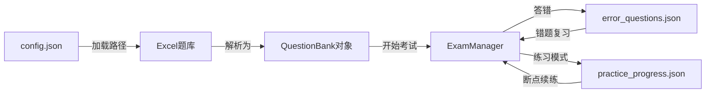

# PC应用技术文档 - 数据格式规范

## 文件概述

本文档详细说明所有数据文件的格式规范,便于跨平台数据迁移和兼容。

---

## 1. config.json - 应用配置

### 文件路径
```
pc-app/config.json
```

### 用途
保存用户的上次使用配置,实现题库自动加载。

### 数据结构
```json
{
    "last_bank_path": "C:/Users/<用户名>/Desktop/题库文件.xlsx"
}
```

### 字段说明
| 字段 | 类型 | 必需 | 说明 |
|------|------|------|------|
| last_bank_path | string | 否 | 上次加载的题库文件绝对路径 |

### 读写逻辑

**写入** (ui_build.py#1302-1306):
```python
try:
    with open("config.json", 'w', encoding='utf-8') as f:
        json.dump({'last_bank_path': file_path}, f)
except:
    pass  # 静默失败,不影响功能
```

**读取** (ui_build.py#95-105):
```python
def load_config_and_bank(self):
    if os.path.exists("config.json"):
        try:
            with open("config.json", 'r', encoding='utf-8') as f:
                config = json.load(f)
                path = config.get('last_bank_path')
                if path and os.path.exists(path):
                    self.load_bank_file(path, silent=True)
        except:
            pass
```

### 跨平台注意
- **路径格式**: Windows使用 `C:/` 或 `C:\\`,需统一处理
- **建议位置**: 
  - Windows: `%APPDATA%/ExamSystem/config.json`
  - macOS: `~/Library/Application Support/ExamSystem/config.json`
  - Linux: `~/.config/exam_system/config.json`
  - Web: `localStorage.setItem('lastBankPath', path)`
  - Android: `SharedPreferences`
  - iOS: `UserDefaults`

---

## 2. error_questions.json - 错题本

### 文件路径
```
pc-app/error_questions.json
```

### 用途
记录用户答错的所有题目,支持错题复习功能。

### 数据结构
```json
[
    {
        "question": "Python是什么语言?",
        "type": "单选题",
        "options": {
            "A": "编程语言",
            "B": "动物",
            "C": "水果"
        },
        "correct_answer": "A",
        "user_answer": "B",
        "source_sheet": "基础题库",
        "timestamp": "2024-11-25 20:30:15"
    },
    {
        "question": "以下哪些是Python特点？",
        "type": "多选题",
        "options": {
            "A": "简单易学",
            "B": "功能强大",
            "C": "难以理解"
        },
        "correct_answer": "AB",
        "user_answer": "AC",
        "source_sheet": "进阶题库",
        "timestamp": "2024-11-25 20:31:42"
    }
]
```

### 字段说明
| 字段 | 类型 | 必需 | 说明 |
|------|------|------|------|
| question | string | 是 | 题目内容 |
| type | string | 是 | 题型: 单选题/多选题/判断题/简答题 |
| options | object | 否 | 选项字典,简答题可为空 |
| correct_answer | string | 是 | 正确答案 |
| user_answer | string | 是 | 用户答案(可能为空或错误) |
| source_sheet | string | 是 | 题目来源 |
| timestamp | string | 是 | 答题时间 ISO格式 |

### 写入逻辑 (exam_core.py#21-32)
```python
def add_error(self, question, user_answer):
    error_entry = {
        'question': question['question'],
        'type': question['type'],
        'options': question['options'],
        'correct_answer': question['answer'],
        'user_answer': user_answer,
        'source_sheet': question.get('source_sheet', 'Unknown'),
        'timestamp': datetime.now().strftime("%Y-%m-%d %H:%M:%S")
    }
    self.errors.append(error_entry)
    self.save_errors()
```

### 跨平台注意
- **数组结构**: 可能包含大量数据,应考虑分页或索引优化
- **时间格式**: 统一使用 `YYYY-MM-DD HH:MM:SS` 格式
- **去重**: 当前实现会记录重复错题,可添加去重逻辑
- **存储优化**: 
  - SQLite: 更适合大量错题
  - Web: IndexedDB 或后端API
  - 移动端: Room(Android) / CoreData(iOS)

---

## 3. practice_progress.json - 练习进度

### 文件路径
```
pc-app/practice_progress.json
```

### 用途
保存用户在专项练习中的进度,支持断点续练。

### 数据结构
```json
{
    "一级": {
        "单选题": {
            "index": 15,
            "wrong_indices": [3, 7, 12]
        },
        "多选题": {
            "index": 5,
            "wrong_indices": [2]
        }
    },
    "一级,二级": {
        "判断题": {
            "index": 8,
            "wrong_indices": []
        }
    }
}
```

### 字段说明
| 字段层级 | 类型 | 说明 |
|---------|------|------|
| 第一层Key | string | 等级组合,多个等级用逗号分隔排序 |
| 第二层Key | string | 题型名称 |
| index | number | 当前练习到的题目索引 (0-based) |
| wrong_indices | array | 答错的题目索引列表 |

### 读写逻辑 (ui_build.py#1218-1256)

**读取**:
```python
def load_practice_progress(self):
    if os.path.exists(self.practice_file):
        try:
            with open(self.practice_file, 'r', encoding='utf-8') as f:
                return json.load(f)
        except:
            return {}
    return {}
```

**写入**:
```python
def save_current_practice_progress(self, add_wrong=False, remove_wrong=False):
    # 生成等级键(排序确保一致性)
    level_key = ",".join(sorted(self.current_practice_levels))
    q_type = self.questions[0]['type']
    
    # 初始化数据结构
    if level_key not in self.practice_data:
        self.practice_data[level_key] = {}
    if q_type not in self.practice_data[level_key]:
        self.practice_data[level_key][q_type] = {'index': 0, 'wrong_indices': []}
    
    # 更新进度
    data = self.practice_data[level_key][q_type]
    data['index'] = self.current_index
    
    # 管理错题索引
    if add_wrong and self.current_index not in data['wrong_indices']:
        data['wrong_indices'].append(self.current_index)
    if remove_wrong and self.current_index in data['wrong_indices']:
        data['wrong_indices'].remove(self.current_index)
    
    self.save_practice_progress()
```

### 使用场景

1. **进入练习**:
   - 读取进度,从 `index` 位置继续
   - 标记 `wrong_indices` 中的题目为"曾答错"

2. **答题过程**:
   - 答对: 从 `wrong_indices` 移除(如果存在)
   - 答错: 添加到 `wrong_indices`
   - 更新 `index` 为当前题号

3. **退出练习**:
   - 保存当前 `index`,下次从此处继续

### 跨平台注意
- **等级键生成**: 必须排序,确保 `"一级,二级"` 和 `"二级,一级"` 是同一个键
- **索引有效性**: 题库更新后索引可能失效,需添加边界检查
- **数据迁移**: 题库结构变化时需要清理或迁移进度数据

---

## 4. Excel题库文件格式

### 文件格式
- **扩展名**: `.xlsx` (Excel 2007+)
- **编码**: UTF-8

### Sheet结构

#### Sheet命名规则
- ✅ 包含"考核题库": `一级考核题库`、`2024考核题库`
- ✅ 名为"Sheet1"
- ❌ 包含"透视": `透视表`、`数据透视` (自动跳过)

#### 表头位置
**第4行** (索引3) 为表头,前3行可用于标题和说明。

#### 必需列

| 列名 | 类型 | 示例值 | 说明 |
|------|------|--------|------|
| 考题类型 | 文本 | 单选题 | 必须是: 单选题/多选题/判断题/简答题 |
| 题目 | 文本 | Python是什么? | 题干内容 |
| 答案 | 文本 | A 或 AB 或 √ | 正确答案 |

#### 可选列

| 列名 | 类型 | 示例值 | 说明 |
|------|------|--------|------|
| 选项A | 文本 | 编程语言 | 选择题选项 |
| 选项B | 文本 | 动物 | 选择题选项 |
| 选项C | 文本 | 水果 | 选择题选项 |
| 选项D | 文本 | ... | 选择题选项 |
| 选项E | 文本 | ... | 选择题选项 |
| 一级 | 任意 | ✓ 或 1 | 非空表示属于一级 |
| 二级 | 任意 | ✓ 或 1 | 非空表示属于二级 |
| 三级 | 任意 | ✓ 或 1 | 非空表示属于三级 |
| 四级 | 任意 | ✓ 或 1 | 非空表示属于四级 |
| 五级 | 任意 | ✓ 或 1 | 非空表示属于五级 |
| 六级 | 任意 | ✓ 或 1 | 非空表示属于六级 |
| 来源 | 文本 | 2024题库 | 题目来源标识 |

### 完整示例

```
第1行:  技能士考试题库 - 2024版
第2行:  说明: 本题库包含一级至六级的所有题目
第3行:  (空行)
第4行:  考题类型 | 题目 | 选项A | 选项B | 选项C | 答案 | 一级 | 二级 | 来源
第5行:  单选题 | Python是什么语言? | 编程语言 | 动物 | 水果 | A | ✓ |  | 基础题库
第6行:  多选题 | Python特点? | 简单 | 强大 | 难学 | AB | ✓ | ✓ | 基础题库
第7行:  判断题 | Python是脚本语言 | √ | × |  | √ |  | ✓ | 进阶题库
第8行:  简答题 | 解释Python GIL |  |  |  | 全局解释器锁 |  | ✓ | 进阶题库
```

### 数据验证规则

1. **题目和答案不能为空**
2. **选择题必须有至少2个选项**
3. **判断题选项必须包含√/×或正确/错误**
4. **多选题答案必须是选项字母的组合(如"AB")**
5. **至少标记一个等级**

### 跨平台解析

**Web (SheetJS)**:
```javascript
const workbook = XLSX.read(data, {type: 'binary'});
const sheet = workbook.Sheets[workbook.SheetNames[0]];
const jsonData = XLSX.utils.sheet_to_json(sheet, {header: 'A', range: 3});
```

**Android (Apache POI)**:
```kotlin
val workbook = XSSFWorkbook(FileInputStream(file))
val sheet = workbook.getSheetAt(0)
val headerRow = sheet.getRow(3)  // 第4行
```

**iOS (CoreXLSX)**:
```swift
let file = try XLSXFile(filepath: path)
for worksheet in try file.parseWorksheets() {
    let rows = worksheet.data?.rows.dropFirst(3)  // 跳过前3行
}
```

---

## 数据文件关系图



---

## 数据迁移指南

### 从PC到Web
```javascript
// 1. 配置数据
localStorage.setItem('lastBankPath', path);

// 2. 错题数据
const errors = await fetch('/api/errors').then(r => r.json());

// 3. 练习进度
const progress = JSON.parse(localStorage.getItem('practice_progress'));
```

### 从PC到Android
```kotlin
// 1. 配置数据
val prefs = context.getSharedPreferences("config", Context.MODE_PRIVATE)
prefs.edit().putString("last_bank_path", path).apply()

// 2. 错题数据 (建议使用Room数据库)
@Entity(tableName = "errors")
data class ErrorQuestion(
    @PrimaryKey(autoGenerate = true) val id: Long,
    val question: String,
    val type: String,
    val correctAnswer: String,
    val userAnswer: String,
    val timestamp: Long
)
```

### 从PC到iOS
```swift
// 1. 配置数据
UserDefaults.standard.set(path, forKey: "lastBankPath")

// 2. 错题数据 (建议使用CoreData)
let error = ErrorQuestion(context: context)
error.question = "..."
error.timestamp = Date()
```

---

## 数据安全建议

### 1. 备份策略
```python
import shutil
from datetime import datetime

def backup_data():
    timestamp = datetime.now().strftime("%Y%m%d_%H%M%S")
    shutil.copy("error_questions.json", f"backups/errors_{timestamp}.json")
    shutil.copy("practice_progress.json", f"backups/progress_{timestamp}.json")
```

### 2. 数据加密(可选)
```python
import json
from cryptography.fernet import Fernet

def save_encrypted(data, key):
    f = Fernet(key)
    encrypted = f.encrypt(json.dumps(data).encode())
    with open("data.encrypted", 'wb') as file:
        file.write(encrypted)
```

### 3. 数据验证
```python
def validate_error_entry(entry):
    required_fields = ['question', 'type', 'correct_answer', 'user_answer', 'timestamp']
    return all(field in entry for field in required_fields)
```

---

## 下一步阅读
[技术文档-07-跨平台适配.md](./技术文档-07-跨平台适配.md) - 完整的跨平台移植指南
